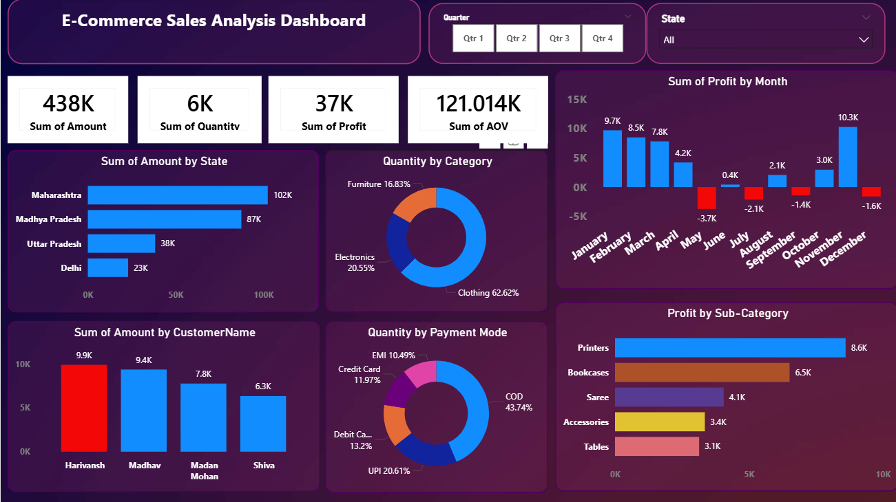

# E-Commerce-Sales-Analysis-Dashboard
An interactive Power BI dashboard analyzing e-commerce sales, profitability, payment preferences, and state-wise performance to drive business decisions.

An end-to-end Business Intelligence project analyzing e-commerce sales data to uncover key insights into customer purchasing behavior, regional performance, category profitability, and payment mode preferences. 

---

## 📊 Dashboard Preview

---

## 🚀 Project Overview
This project transforms raw transactional data into an interactive dashboard, enabling stakeholders to track revenue trends, identify high-performing states, and optimize product category strategies. The dashboard allows filtering by Quarter and State for granular, dynamic analysis.

---

## 📂 Dataset Overview
The analysis is based on two primary datasets containing a total of 1,500 order line items across 500 unique orders:
* **Orders Data (`Orders.csv`):** Contains order tracking information including `Order ID`, `Order Date`, `CustomerName`, `State`, and `City`.
* **Order Details (`Details.csv`):** Contains line-item transaction metrics including `Amount`, `Profit`, `Quantity`, `Category`, `Sub-Category`, and `PaymentMode`.

---

## 📈 Key Performance Indicators (KPIs)
* **Total Sales Amount:** 438K
* **Total Quantity Sold:** 6K units
* **Total Profit:** 37K
* **Average Order Value (AOV):** 121K

---

## 🔍 Key Insights & Findings
1. **Top Performing States:** Maharashtra (102K) and Madhya Pradesh (87K) drive the highest sales volume.
2. **Category Dominance:** Clothing constitutes the majority of the sales quantity (62.62%), followed by Electronics (20.55%) and Furniture (16.83%).
3. **Payment Preferences:** Cash on Delivery (COD) is the most preferred payment method (43.74%), followed by UPI (20.61%). 
4. **Profit Drivers:** Printers (8.6K) and Bookcases (6.5K) are the most profitable sub-categories.
5. **Seasonal Trends:** Profitability fluctuates significantly by month, peaking in December (10.3K) and January (9.7K), while dropping into negative margins during May.

---

## 🛠️ Tools & Technologies
* **Data Source:** CSV Files
* **Data Cleaning & Modeling:** Power Query
* **Data Visualization & BI:** Microsoft Power BI

